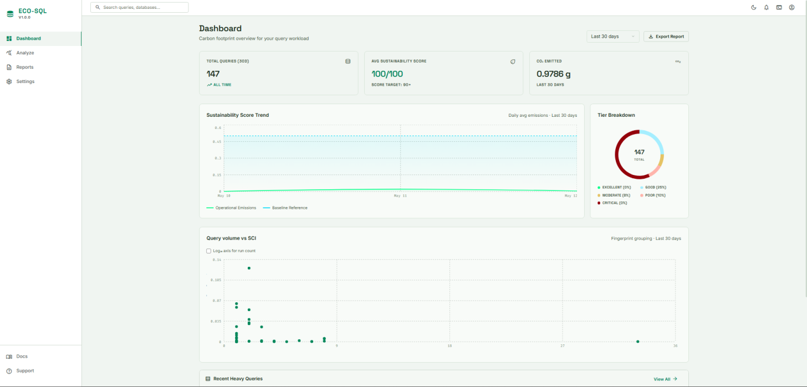
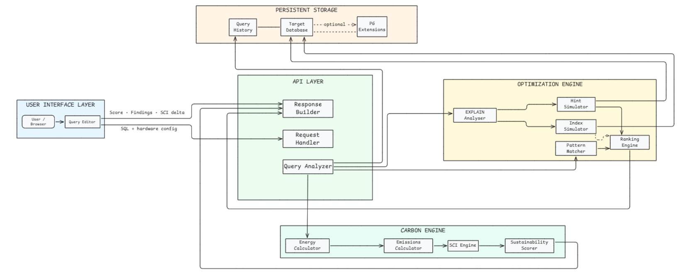
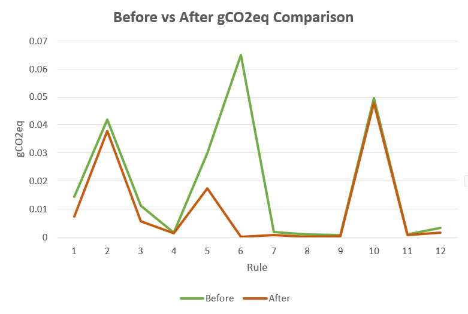

# ECO-SQL

**Environmental Carbon Optimization for SQL**

ECO-SQL is a full-stack sustainability analyzer for PostgreSQL workloads. It combines SQL query optimization with carbon footprint estimation — going beyond traditional query analyzers by evaluating environmental impact through execution time, planner cost, CPU/memory usage, and Power Usage Effectiveness (PUE).

Emissions are estimated using the **Software Carbon Intensity (SCI)** framework, with optimization suggestions to promote greener database engineering practices.

---

## Table of Contents

- [Screenshots](#screenshots)
- [Features](#features)
- [Architecture](#architecture)
- [Tech Stack](#tech-stack)
- [Sustainability Scoring](#sustainability-scoring)
- [Carbon Estimation Model](#carbon-estimation-model)
- [Experimental Results](#experimental-results)
- [Installation](#installation)
- [Usage](#usage)
- [API Endpoints](#api-endpoints)
- [Safety Notice](#safety-notice)
- [Roadmap](#roadmap)
- [Contributing](#contributing)

---

## Screenshots

### Dashboard



Carbon footprint overview showing total queries, average sustainability score, CO₂ emitted, score trend, tier breakdown, and query volume vs. SCI.

> More screenshots (Analyze page, Reports) can be added to `docs/images/` and linked here.

---

## Features

### 🔍 Query Carbon Analysis
- Query-level energy consumption measurement
- Operational and embodied carbon emission estimates
- Software Carbon Intensity (SCI) calculation
- Sustainability score generation

### ⚡ SQL Optimization Engine
Two layers of anti-pattern detection run side by side:

**Instant quick-check** (runs automatically on every `POST /api/analyze` call) — a lightweight, regex-based scan (`queryOptimizer.js`) that flags common issues in plain language, with a "why it matters", "what to do", and a before/after example for each:

<details>
<summary>Show full list</summary>

- `SELECT *` detected
- Missing `WHERE` clause
- Missing `LIMIT` clause
- Potential missing indexes on filter/join columns (with generated `CREATE INDEX` DDL)
- Leading wildcard `LIKE`
- Function on column in predicate (non-sargable, e.g. `LOWER(col)`)
- `ORDER BY` may be unindexed
- Possible Cartesian join (missing `ON`/`USING`)
- `DISTINCT` detected
- Repeated subquery detected
- Sequential scan / high-cost or high-row plan node (when an EXPLAIN plan is supplied)

</details>

**Deep pattern engine** (`sqlPatternMatcher.js`, used by `POST /api/optimize-query`) — matched against the query's actual EXPLAIN plan and includes automatic query rewrites (e.g. hoisting a correlated aggregate subquery into a `LEFT JOIN LATERAL`):

<details>
<summary>Show full list</summary>

- Leading wildcard `LIKE`
- Correlated subqueries
- `UNION` without `ALL`
- Large `OFFSET` usage
- `SELECT *`
- `NOT IN` subqueries
- Implicit type coercion
- `HAVING` without `GROUP BY`
- Repeated `OR` equality conditions
- `DISTINCT` with `JOIN`
- `COUNT(column)` instead of `COUNT(*)`

</details>

### 🧠 Optimization Simulation
- EXPLAIN plan analysis with a collapsible, severity-coded plan tree
- Hypothetical index simulation via **HypoPG** (no locks, no writes to the real schema)
- Planner hint evaluation via **pg_hint_plan**
- Ranked findings (`FindingCard`) with suggested index DDL, cost delta, and estimated SCI delta
- SCI **before vs. after** comparison chart for proposed fixes

### 🌍 Scale & Impact Context
- Scaled emissions projection at 1K / 100K / 1M executions
- Real-life carbon equivalents (e.g. km driven, phone charges) at a configurable execution multiplier
- Query volume vs. SCI scatter plot for spotting high-impact query fingerprints

### 📊 Interactive Dashboard
- Carbon emission trends and sustainability score trend
- Sustainability tier distribution (donut breakdown)
- Recent heavy queries
- Query history with search, classification filter, and CSV export
- Per-query detail view with plan tree, findings, and re-analysis

### ⚙️ Settings & Hardware Configuration
- Auto-detected hardware profile (CPU model/cores, RAM, estimated power draw) via Node's `os` module, cached per server process for consistent results
- One-click presets for **Cloud**, **On-Premises**, and **Laptop** deployments (PUE + grid intensity)
- Manual override for PUE, grid carbon intensity, and hardware lifespan from the UI (per-request, sent with each `/api/analyze` call)
- Server-level defaults can also be pinned via environment variables (`PUE`, `INFRASTRUCTURE`, `EMBODIED_CARBON`, `HARDWARE_TYPE`, `RESERVED_RATIO`, `TOTAL_OPERATING_HOURS`, `GRID_CARBON_INTENSITY`, `CPU_UTILIZATION`) — see `backend/.env.example`
- Database/table browser for the connected PostgreSQL instance

---

## Architecture



The UI sends the SQL query and hardware config to the API layer. The **Query Analyzer** runs it against the target database and hands the plan to the **Carbon Engine** (energy → emissions → SCI → sustainability score) and the **Optimization Engine** (EXPLAIN analysis, index/hint simulation, pattern matching, ranking). Results — score, findings, SCI delta — flow back through the **Response Builder**, and the query plus its metrics are persisted to query history.

## Tech Stack

| Category | Technologies |
|---|---|
| Frontend | React.js, Vite, Recharts |
| Backend | Node.js, Express.js |
| Database | PostgreSQL |
| SQL Analysis | `EXPLAIN (FORMAT JSON)` |
| Extensions | HypoPG, pg_hint_plan |
| API Communication | Axios |
| Routing | React Router |

---

## Sustainability Scoring

Queries are classified into five sustainability tiers:

| Score Range | Tier |
|---|---|
| 90 – 100 | 🟢 EXCELLENT |
| 75 – 89 | 🟢 GOOD |
| 50 – 74 | 🟡 MODERATE |
| 25 – 49 | 🟠 POOR |
| 0 – 24 | 🔴 CRITICAL |

## Carbon Estimation Model

ECO-SQL estimates energy consumption, operational emissions, embodied emissions, and SCI using:

- CPU utilization
- Memory draw
- Runtime
- Power Usage Effectiveness (PUE)
- Grid carbon intensity
- Hardware amortization

---

## Experimental Results



Measured SCI (gCO2eq per query) before and after applying the suggested fix, for test queries exercising each of the 12 detected anti-pattern rules. Rules with the largest baseline footprint see the biggest absolute drop once the recommended index, filter, or join fix is applied, while already-cheap rules show little to no change — confirming the optimization engine's suggestions translate into a real emissions reduction, not just a lower planner cost.

---

## Installation

### Prerequisites
- Node.js >= 18
- npm >= 9
- PostgreSQL >= 14

### 1. Clone the repository
```bash
git clone https://github.com/your-username/ECO-SQL.git
cd ECO-SQL
```

### 2. Backend setup
```bash
cd backend
npm install
```

Copy the example env file and fill in your database credentials:
```bash
cp .env.example .env
```

`.env.example` documents every supported variable, including the required connection/server settings and optional carbon-model overrides:

| Variable | Required | Purpose |
|---|---|---|
| `DB_HOST`, `DB_PORT`, `DB_USER`, `DB_PASSWORD`, `DB_NAME` | Yes | PostgreSQL connection |
| `PORT` | No (default `3001`) | Backend server port |
| `CORS_ORIGIN` | No (default `http://localhost:5173`) | Allowed frontend origin |
| `PUE` | No | Override Power Usage Effectiveness (1.0–3.0) |
| `INFRASTRUCTURE` | No | `cloud` → PUE 1.15; anything else → 1.3 |
| `EMBODIED_CARBON` | No | Override total embodied carbon (gCO2eq) |
| `HARDWARE_TYPE` | No | `server` → 200,000 gCO2eq · `laptop` → 75,000 · else → 100,000 (desktop) |
| `RESERVED_RATIO` | No | Fraction of system resources reserved for a single query (0–1) |
| `TOTAL_OPERATING_HOURS` | No | Expected total operating hours of the hardware |
| `GRID_CARBON_INTENSITY` | No | Grid carbon intensity in gCO2eq/kWh |
| `CPU_UTILIZATION` | No | CPU utilization during query execution (0–1) |

Run the backend:
```bash
npm run dev
```

### 3. Frontend setup
```bash
cd frontend
npm install
npm run dev
```

### 4. (Optional) Enable PostgreSQL extensions
For advanced optimization simulation:
```sql
CREATE EXTENSION hypopg;
CREATE EXTENSION pg_hint_plan;
```

---

## Usage

1. Connect ECO-SQL to your target PostgreSQL database.
2. Paste or write a SQL query into the analyzer.
3. Review the generated sustainability report — carbon estimates, SCI score, and optimization suggestions.
4. Apply suggested optimizations and re-run to compare before/after SCI deltas.

---

## API Endpoints

| Endpoint | Description |
|---|---|
| `POST /api/analyze` | Analyze a SQL query and compute its carbon footprint |
| `POST /api/optimize-query` | Run EXPLAIN analysis, index/hint simulation, and SQL pattern matching |
| `GET /api/databases` | List PostgreSQL databases |
| `GET /api/databases/:dbName/tables` | List tables in a database |
| `GET /api/hardware-config` | Detected/configured hardware assumptions |
| `GET /api/history` | Query history (search, classification filter, pagination) |
| `GET /api/history/:id` | Fetch a single history record |
| `PATCH /api/history/:id/optimized` | Mark a history record as optimized |
| `DELETE /api/history` | Clear query history |
| `GET /api/history/export` | Export history as CSV |
| `GET /api/dashboard` | Dashboard analytics (trend, tier distribution, recent queries) |
| `GET /health` | Health check |

---

## Safety Notice

⚠️ ECO-SQL executes submitted SQL queries **directly** against the selected PostgreSQL database.

✅ **Recommended:** development, test, and staging environments
❌ **Avoid:** production or critical live systems

---

## Roadmap

- [ ] MySQL and SQL Server support
- [ ] Real-time electricity grid integration
- [ ] ML-based query sustainability prediction
- [ ] CI/CD integration
- [ ] Automatic SQL rewrite suggestions
- [ ] Dockerized deployment
- [ ] Multi-user support

---

## Contributing

This started as an academic mini-project, but contributions are welcome:

1. Fork the repo and create a feature branch.
2. Keep backend services (`carbonCalculator`, `explainAnalyzer`, `sqlPatternMatcher`, etc.) pure/testable where possible.
3. Run both the backend and frontend locally and verify `POST /api/analyze` + `POST /api/optimize-query` before opening a PR.
4. Describe what changed and why in the PR description.

Bug reports and feature requests are welcome via GitHub Issues.


---

*This project contributes toward UN Sustainable Development Goals 7 (Affordable and Clean Energy), 9 (Industry, Innovation and Infrastructure), and 13 (Climate Action).*